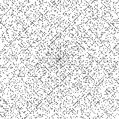

# UlamSpiral
An Ulam spiral generator written in Rust.

# Usage
## Building
`cargo build --release`
## Running
`./target/release/UlamSpiral -s <SIZE>`

# Demo
Output for `./target/release/UlamSpiral -s 200`:

